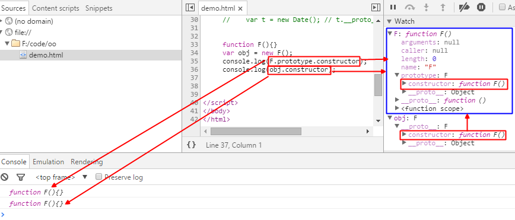
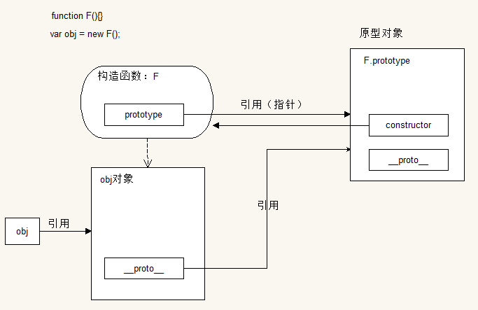
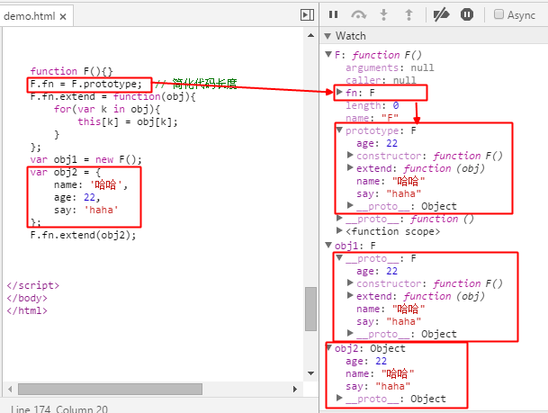

# JS 中的原型

在 Javascript 中可以说原型是在原生开发中比较重要的一个概念  
要想在原生 JS 开发中得心应手，必须熟悉原型、原型对象、原型属性之间的关系  
还要熟悉原型链，以及原型链搜索原则  

## 原型属性
### `prototype`

在js中每当我们创建一个函数的时候就会有一个`prototype`（原型）属性  
这个属性其实是存储的一个引用（指针），指向一个对象，这个对象中有属性和方法  
声明一个函数`function F(){}`  


其关系结构为：


在js中, 对象 ` { } `  中包含 `toString`  、`valueOf ` 和 `constructor`  等  
方法, 实际上就是由原型继承来实现的。对象继承自原型对象 `Object.property`  

那么原型又有什么卵用呢？  
看一个demo  
```javascript
// 声明一个构造函数  内部有一个方法fn
function F(){
  this.fn = function(){
    console.log('hello world');
  };
}
// 实例化两个F对象 ： f1和f2
var f1 = new F();
var f2 = new F();
f1.fn();  // => hello world
f2.fn();  // => hello world
// 进行比较两个实例对象的fn方法
console.log(f1.fn === f2.fn);  // => false
```

通过比较两个实例对象的 `fn` 方法可以得出：每个实例对象的 `fn` 方法是独立存在的  


那么问题就来了？  
两个 `F` 类型实例有同样功能的方法却占用了两块不同的内存空间  
这无疑造成了内存的泄露  
因此，就有了`prototype`（原型）的概念  

对上面的demo改造一下：  
```javascript
// 声明一个构造函数  内部有一个方法fn
function F(){}
F.prototype.fn = function(){
  console.log('hello world');
};
// 实例化两个F对象 ： f1和f2
var f1 = new F();
var f2 = new F();
f1.fn();  // => hello world
f2.fn();  // => hello world
// 进行比较两个实例对象的fn方法
console.log(f1.fn === f2.fn);  // => true
```


那么`prototype`里面又有什么呢？  


`prototype`就是通过调用构造函数（ `F` ）创建出来的那个对象（ `f1` 和 `f2` ）的原型对象  

**优点：** 资源共享
说白了就是可以让所有的对象实例共用原型对象里面的所有属性和方法  


## 原型对象
### `__proto__`
在创建函数时，其内部的 `prototype` （原型）属性所指向的那个对象就是原型对象  
当我们创建一个对象时，其实是存在两个对象：  
一个是当前对象（对象本身），一个是原型对象  
即每个对象都有一个 `__proto__` （原型）属性，指向其原型对象  
对象的原型（ `__proto__` ）就是其构造函数的一个属性（ `prototype` ）  

由某一函数 `new` 出来的对象，会自动的链接到该函数的 `prototype` 上  

看下面的demo：  


具体一点也就是：  
通过构造函数 `F` 创建出来的对象 `obj`，该对象的默认会有一个 `__proto__` 属性，  
并且该属性会自动链接到构造函数 `F` 的原型对象上（ `F.prototype` ），  
并且该对象继承了 `F.prototype` 的所有属性和方法。  


即通过对象的 `__proto__` 属性可以直接访问到该对象的原型对象  
不过该属性是个非标准属性，可能会存在一些浏览器不支持  
在开发中不建议使用，后面会介绍一个通用的方法  
```javascript
  function F(){}
  var obj = new F();
  console.log(obj.__proto__ === F.prototype);  // => true
```

### `constructor`
每个对象都可以访问到一个 `constructor`（构造函数）属性  
在默认情况下，所有的原型对象都会有这样一个属性  
这个属性存储着指向 `prototype` 所在函数的引用（指针）  
可以这么理解：  
其实 `constructor` 属性是由该对象的原型对象提供的  
`constructor` 属性描述是该对象的构造函数  


给之前的一张图添加一个 `constructor` 属性  



那么现在就可以对上面提到的通过对象的 `__proto__` 属性访问其原型对象  

做一个通用的处理  
```javascript
function F(){}
var obj = new F();
console.log(obj.__proto__);  // 在IE8 中 =>   undefined 
```

进行浏览器能力检测，不存在添加一个  
```javascript
if(! {}.__proto__){
  Object.prototype.__proto__ = function(){
    return this.constructor.prototype;
  };
}
function F(){}
var obj = new F();
console.log(obj.__proto__);  //  ???
```

## 获取对象的类型
创建什么对象，所描述的是构造函数的名字  
构造函数的名字就是其创建出来的对象的类型名  
```javascript
function F(){}
var obj = new F();
```

`new`一个`F`，即创建了一个`F`对象，并把创建的`F`对象赋值给了`obj`  
也就是实例化了一个`F`对象`obj`  
有时候在对对象进行操作时需要知道其类型  

那么如何获得对象的类型？  
**1、传统的通过字符串来处理函数**  
```javascript
function F(){}
var obj = new F();
// 获取其构造函数 + '' 将其转化成字符串形式
var str = obj.constructor + '';
console.log(str);  // => function F(){}
// 字符串太长不便操作  把公共的 function和后面的空格 替换成 _
str = str.replace('function ','_');
console.log(str);  // => _F(){}
// 获取 _ 和 ( 的索引  以便进行字符串截取
var start = str.indexOf('_');
var end = str.indexOf('(');
// 如果字符串中不存在指定字符  则返回 -1
if(start != -1 && end != -1){
  var fnName = str.slice(start + 1, end);
}
// 前后分别加上 |   用于验证是否包含空格
console.log('|' + fnName + '|');  // => |F|
```
为了获取对象类型，这无疑也太麻烦了  

**2、利用正则表达式进行匹配获取**  
```javascript
function F123(){}
var obj = new F123();
var str = obj.constructor + '';
var reg = /function (.+)\(/;
console.log(reg.exec(str));  
// => ["function F(", "F", index: 0, input: "function F(){}"]
// exec 返回一个数组集合  
// 第一项为正则表达式匹配成功的字符串  
// 第二项为正则表达式里的第一个分组项匹配成功的字符串。。。
var fnName = reg.exec(str)[1];
console.log('|' + fnName + '|');  // => |F123|
```
比第一个精简了一点，不过还是不好  

**3、通过构造函数的`name`属性获取**  
```javascript
function F111(){}
var obj = new F111();
// 先获取到其构造函数 再获取构造函数的名字
var fnName = obj.constructor.name;
console.log(fnName);  // => F111
```
这个方法很好用  不过IE8之前的浏览器不支持  

封装一个通用的方法 `getFnName`  
```javascript
function getFnName(obj){
  return obj.constructor.name || /function (.+)\(/.exec(obj.constructor + '')[1];
}
function F123(){}
var obj = new F123();
console.log(getFnName(obj));  // => F123
```

## 对象的属性访问
如果访问对象的属性：  
就会先在当前对象中去找  
如果没有就去当前对象的原型对象中去找  
如果再没有就去原型链上去找  
```javascript
function Person(){
  this.name = 'haha';
}
Person.prototype.name = '哈哈';
var p1 = new Person();
p1.name = '123';
console.log(p1.name);  // => 123
```

把对象中的name属性去掉  
```javascript
function Person(){
  this.name = 'haha';
}
Person.prototype.name = '哈哈';
var p1 = new Person();
console.log(p1.name);  // => haha
```

再把构造函数中的name属性去掉  
```javascript
function Person(){
  this.name = 'haha'; // [!code --]
}
Person.prototype.name = '哈哈';
var p1 = new Person();
p1.name = '123'; // [!code --]
console.log(p1.name);  // => 哈哈
```

## 原型对象和原型属性的区别
**相同点：**
* 这两个都是属性， 简单说就是存储引用的变量
* 这两个属性的引用指向同一个对象
* 本质上：原型对象和原型属性指的是同一个东西

**不同点：**
* 原型对象：`__proto__` 是站在对象的角度，是该对象的原型对象
* 原型属性：`prototype` 是站在构造函数的角度
* 是该对象的构造函数的原型属性
* 或是构造函数创建的对象的原型对象

**作用：**
* 在实现继承的时候，一般都是使用 构造函数的 `prototype` 属性
* 在分析结构与验证对象等测试与调试中，会用到 `__proto__`

## 继承

继承是面向对象语言的一个比较重要的特性  
在js中为了达到资源的共享，引入了继承的概念  
继承说白了就是自己没有的东西，别人有，直接拿过来，使其成为自己的  
即继承就是：拿来主义  
在继承中, 一个对象继承自另一个对象  
继承的对象中包含被继承对象的所有成员  
那么为什么要用继承呢？  
继承可以简化代码，达到复用的效果  
减少代码体积  
便于后期的维护  


### 原型式继承
如果需要让一个对象有某一行为（属性、方法）  
那么可以考虑将这个行为加到原型对象中  
那么这个对象就继承自原型对象，获得了该行为  
什么是原型式继承？  
即对象继承自其原型对象  
所谓的原型式继承就是在对象的原型对象中加内容即可  

#### 利用动态添加属性实现
```javascript
function F(){}
F.prototype.fn = function(){ console.log('大家好'); };
var obj = new F();
```

#### 覆盖原型
```javascript
function F(){}
F.prototype = {
  name : '哈哈',
  say : '你好',
  hello : 'hello'
};
var obj = new F();
```

这时 `obj` 的原型对象就被覆盖掉了  
同时原型对象中的 `constructor` 也不存在了  
接下来，再复杂一点：  
```javascript
function F(){}
var obj1 = new F();
F.prototype = {
  name : '哈哈',
  say : '你好',
  hello : 'hello'
};
var obj2 = new F();
```


可以画出关系图：  


通过`var obj1 = new F();`实例化一个对象时  
就会自动链接到`F`的`prototype`属性上，即`obj1`的原型对象上  
当`F.prototype = {...};`，这时的`F.prototype`的引用就指向了一个新赋值的对象了  
此时的`obj1`的原型对象依然存在，而且还是原始的原型对象  


### 组合式原型继承
```javascript
function F(){}
F.fn = F.prototype;
F.fn.extend = function(obj){
  for(var k in obj){
    this[k] = obj[k];
  }
};
var obj1 = new F();
var obj2 = {
  name: '哈哈',
  age: 22,
  say: 'haha'
};
F.fn.extend(obj2);
console.log(obj1);
console.log(obj2);
```



### 组合式继承
```javascript
var o1 = {
  name: 'haha',
  age: 22
};  
var o2 = {
  say: '你好'
};
o2.extend = function(obj){
  for(var k in obj){
    this[k] = obj[k];
  }
};
o2.extend(o1);
console.log(o1);  // => Object {name: "haha", age: 22}
console.log(o2);  // => Object {say: "你好", name: "haha", age: 22}
```

### 经典的继承
```javascript
function create (obj) {
  if (Object.create) {
    return Object.create(obj);
  } else {
    function F(){}
    F.prototype = obj;
    return new F();
  }
}
var o1 = {
  name: 'haha'
};
var o2 = create(o1);
```

## 构造函数
构造函数就是函数的一种特殊表现形式  
任何函数都可以做构造函数来使用  

**作用：**初始化对象  
**意义：**代码的复用  

`new` 就是在创建对象  
让一个对象从无到有  
即实例化这个构造函数  
对象的属性由构造函数决定的  
对象的原型对象由构造函数的 `prototype` 属性决定的  
函数的 `prototype` 所指向的对象的 `constructor` 指向当前函数  
构造函数如何初始化，就看 `this`
在没有构造函数时给对象添加成员（属性或方法），往往采用： `对象.成员 = 值`

创建对象的整个过程：  
1. `new` 申请内存空间
2. 调用构造函数， 构造函数有一个隐式参数，即 `this`
3. 刚创建出来的对象的引用 赋值给 `this`，由构造函数处理
4. 在构造函数中利用 `this.成员 = 值` 来给对象添加成员

**结论**
1. 定义函数，函数会有一个 `prototype` 属性
2. 函数的 `prototype` 属性是一个对象类型
3. `prototype` 属性是一个含有 `constructor` 与 `__proto__` 属性的对象  
    这个对象就是`Person.prototype`
4. `constructor` 属性就是当前函数  
    **推论：**函数的 `prototype` 属性的 `constructor` 就是当前函数  
5. 所有的函数的 `prototype` 属性所表示的对象都继承自 `Object.prototype`  
    即：`函数.prototype.__proto__` 就是 `Object.prototype`

通过构造函数创建对象和对象字面量创建对象的区别？  
对象字面量创建出来的对象的原型对象是 `Object.prototype`  
而通过构造函数创建出来的对象的原型对象是`函数.prototype`  

**优点：**  
1. 通过构造函数创建出来的对象具有独立的原型对象，只影响到当前原型对象
2. 当前对象有类型名了


## 直接继承和间接继承
在js中，每一个对象都有一个原型对象  
并且每一个原型对象都直接，或间接的继承自 `Object.prototype` 对象  

那什么是直接继承呢？  
看下面的demo  
```javascript
function Person(){}
var p = new Person();
```
这时 `Person` 的实例 `p` 对象的原型对象就直接继承自 `Object.prototype` 对象  

再看下面的demo  
```javascript
function Animal(){}
function Person(){}
var a = new Animal();
Person.prototype = a;
var p = new Person();
```
此时 `Person` 的 `prototype` 引用被修改，指向了 `a` 对象  
`a` 对象的原型对象继承自 `Object.prototype` 对象  
因此，`Person` 的实例 `p` 对象的原型对象就间接继承自 `Object.prototype` 对象  


## 原型链
在创建一个对象的时候，除了当前对象有原型对象  
原型对象也有原型对象  
原型对象的原型对象也有原型对象  
...  
于是就形成了一条链式结构，这条链式结构就叫原型链  
**结论：**每个对象都有一条最终指向 `null` 的原型链  
```javascript
function Fn(){}
var f1 = new Fn();
```

对象`f1`的原型链结构如下图所示：  


## 对象的属性访问
如果访问对象的属性：  
就会先在当前对象中去找  
如果没有就会去该构造函数中去找  
如果再没有就去该构造函数的原型属性中去找  
如果还是没有就会在当前对象的原型链上去找，直到找到 `null`  
```javascript
function Person(){
  this.name = 'haha';
}
Person.prototype.name = '哈哈';
var p1 = new Person();
p1.name = '123';
console.log(p1.name);  // => 123
```

把对象中的 `name` 属性去掉  
```javascript
function Person(){
  this.name = 'haha';
}
Person.prototype.name = '哈哈';
var p1 = new Person();
p1.name = '123'; // [!code --]
console.log(p1.name);  // => haha
```

再把构造函数中的`name`属性去掉
```javascript
function Person(){
  this.name = 'haha'; // [!code --]
}
Person.prototype.name = '哈哈';
var p1 = new Person();
p1.name = '123'; // [!code --]
console.log(p1.name);  // => 哈哈
```

对象通过初始化来的属性的访问顺序在`对象.属性`动态添加的之后访问  
即先访问`对象.属性`，在访问初始化来的属性  


## `Object.prototype` 中的成员
### `hasOwnProperty()`
**作用：** 检测属性是否是自己原生的，如果被继承返回 `false`  
**用法：** `对象.hasOwnProperty(属性名);`  
```javascript
var o = {name:'haha'};
console.log(o.hasOwnProperty('name'));  // => true

function F(){
  this.name = 'haha';
}
var obj = new F();
obj.age = 22;
console.log(obj.hasOwnProperty('age'));  // => true
console.log(obj.hasOwnProperty('name'));  // => true
F.prototype.sex = '男';
console.log(obj.sex);  // => 男
console.log(obj.hasOwnProperty('sex'));  // => false
```

### `isPrototypeOf()`
**用法：**`obj1.isPrototypeOf(obj2);`

**作用：**判断对象 `obj1` 是否为对象 `obj2` 的原型对象
```javascript
var o1 = {name:'haha'};
var o2 = {name:'haha'};
console.log(o1.isPrototypeOf(o2));  // => false
console.log(Object.prototype.isPrototypeOf(o1));  // => true

function F(){}
F.prototype = o1;
var obj = new F();
console.log(o1.isPrototypeOf(obj));  // => true
```

### `propertyIsEnumerable()`

> `-able` 表示可能性的后缀  
> `enum` 枚举，一个一个的展示出来  

**作用：** 属性是否可以枚举  即属性是否可以被 `for-in` 遍历  
并且同时判断属性是否是自己提供的（两者必须同时满足）  

**语法：** `obj.propertyIsEnumerble(属性名);`  
**返回值：** `boolean`  

### `toString`
**作用：** 将其他类型数据转换成 `string` 类型  
**语法：** `其他类型数据.toString([number])`  
**返回值：** `string`  

可以跟参数，只有在 `number` 类型的数据转换时参数才有效  
参数代表 `number` 类型将要转换的进制数，转换过后同样也是 `string` 类型  
```javascript
var num = 12;
console.log(num.toString());  // => 12
console.log(num.toString(2));  // => 1100
console.log(typeof num.toString(2));  // => string

var bool = true;
console.log(bool.toString(2));  // => true

var str = '123';
console.log(str.toString(2));  // => 123

console.log([].toString());  // => 空
console.log([1, 2, 3].toString());  // => 1,2,3

console.log({}.toString());  // => [object Object]
console.log({name: '哈哈', age: 22}.toString()); // => [object Object]

console.log(Array.toString());  // => function Array() { [native code] }
console.log(Date.toString());  // => function Date() { [native code] }
```

### `toLocaleString`
`toLocaleString` 和 `toString` 的用法和作用基本相同  
不同的是 `toLocaleString` 是转换为本地字符串  

日期类型不同  
```javascript
var time = new Date();
console.log(time);  // => Wed Mar 30 2016 09:57:32 GMT+0800 (中国标准时间)
console.log(time.toString());  // => Wed Mar 30 2016 09:57:32 GMT+0800 (中国标准时间)
console.log(time.toLocaleString());  //=> 2016/3/30 上午9:57:32
```

### `valueOf`
当对象需要转换为数字类型的时候就会调用该方法  
该方法与 `toString` 类似  
```javascript
var o = {};
var num = {};
o.toString = function(){
  console.log('调用了toString');
};
o.valueOf = function(){
  console.log('调用了valueOf');
};
console.log(o - 1);       // => 调用了valueOf    NaN
console.log(o + '');      // => 调用了valueOf    undefined
console.log(Number(o));   // => 调用了valueOf    NaN
console.log(String(o));   // => 调用了toString   undefined
console.log(Boolean(o));  // => true
```

### `instanceof`
**作用：** 判断一个对象是否是该构造函数的实例  
**语法：** `对象 instanceof 构造函数`  
**返回值：** `boolean`  
**结论：** 任意的一个对象都有一条原型链，只要在该链上的构造函数，`instanceof` 返回 `true`  
```javascript
console.log([] instanceof Array);          // => true
console.log([] instanceof Object);         // => true
console.log([] instanceof Function);       // => false

console.log(Array instanceof Function);    // => true
console.log(Date instanceof Function);     // => true

console.log(Object instanceof Function);   // => true
console.log(Function instanceof Object);   // => true

function Fn(){}
console.log(Fn instanceof Function);       // => true
console.log(Fn instanceof Object);         // => true

var f = new Fn();
console.log(f instanceof Fn);              // => true
console.log(f instanceof Function);        // => false

function Foo(){}
var o = new Foo();
Fn.prototype = o;
var f2 = new Fn();
console.log(f2 instanceof Foo);            // => true
```

最后一个案例的结构图如下：  


这也验证了上述的结论，只要构造函数在当前对象的原型链上  
即：`当前对象 instanceof 构造函数 => true`  

## 函数
函数是js的一等公民  
函数也是一个对象  
函数也是一种数据类型  
同 `{ }`、`123`、`'haha'`、`true` 一样是有类型的数据  
即：函数可以作为参数传递  

创建函数的方法：  
1. 声明式: `function Fn(){ }`
2. 表达式: `var fn = function(){ };`
3. 通过Function构造函数: `var fn = new Function();`
```javascript
function Fn(){}
console.log(Fn instanceof Function);        // => true
console.log(Array instanceof Function);     // => true
console.log(Date instanceof Function);      // => true
console.log(Object instanceof Function);    // => true
console.log(Function instanceof Function);  // => true
```
**结论：** 任意函数都是 `Function` 的实例，`Function` 自己也是自己的实例  

**Function**  
**语法：** `var fn = new Function(arg1, arg2, arg3, ..., body);`  

`Function` 构造函数所有的参数都是字符串类型的  
除了最后一个参数，所有的参数都作为生成函数的参数  
这里可以没有前面的参数  
最后一个参数也是字符串，表示的是生成函数的函数体  

看下面两个等价函数：
```javascript
function fn(a, b){
  return a + b;
}

var fn = new Function('a', 'b', 'return a + b;');
```

`Function` 还有一个作用就是：**将字符串当作js代码执行**  

**eval**  
`eval` 也是可以将字符串当作js代码进行执行  
**语法：** `eval( str );`  
`Function` 和 `eval` 都可以实现字符串当作js代码执行  
在实际开发中, 如果考虑效率可以直接使用 `eval`  
但是考虑安全性则建议使用 `Function`  
`eval` 会污染全局作用域  

**结论：**
1. 对象都有原型对象, 对象默认继承自原型对象
2. 函数被定义后, 默认就有原型属性, 原型属性也是对象
3. 函数的原型属性默认继承自 `Object.prototype`
4. 原型对象中 `constructor` 指向对应的构造函数
5. 所有的函数都是 `Function` 的实例
6. 函数也是对象

默认函数的原型属性继承自 `Object.prototype`  
`Function` 是函数，`Function.prototype` 是函数的原型属性  
`Function.prototype` 继承自 `Object.prototype`  
`Array` 是 `Function` 的实例, 继承自 `Fucntion.prototype`  
`Date` 是 `Function` 的实例, 继承自 `Fucntion.prototype`  
`Object` 是 `Function` 的实例, 继承自 `Fucntion.prototype`  
...  
`Fucntion` 是 `Function` 的实例, 继承自 `Fucntion.prototype`  

**结论：** `Function.__proto__ `就是 `Function.prototype`  

最终可以得到函数的原型链：  


## 最后
函数和继承都可以实现代码的复用  
函数是面向过程的思想  
而继承是面向对象的思想  
属性与方法有一个特点是 ：和当前对象息息相关的  
这些与当前对象息息相关的属性与方法就称为：实例属性与实例方法  
那么再函数中, 也可以添加属性与方法  

`function Foo() {}`  
`Foo.name = 'tom';`  
这个属性对于 `Foo` 的实例来说是全局的，和个体对象没有关系  
称这样的属性与方法为：静态属性与静态方法  
实例成员与对象息息相关  
而静态成员一般作为通用的工具性的成员使用  

`{ }` ：有两重意思  
1 代码块 （代码块后面不加分号）  
2 对象  

代码块：`{ }`  
语句：` ; `  
表达式：`值`  

