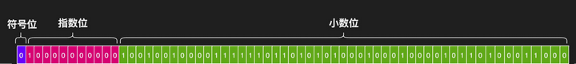
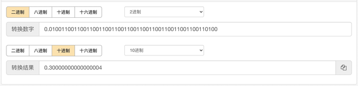
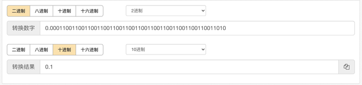
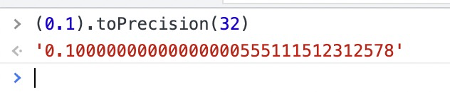
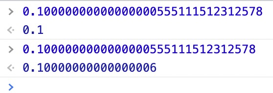
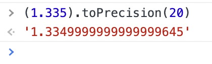
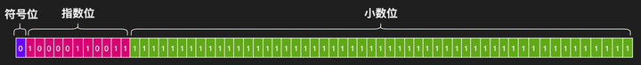
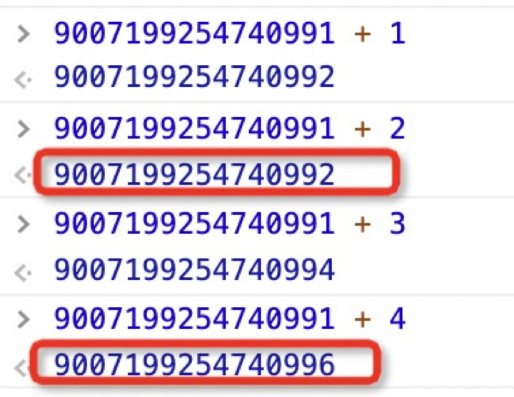

# JS 中为什么 0.1 + 0.2 != 0.3 ?
> 昨天在公司大前端做了一次关于计算机怎么计算的分享，顺便研究了一下JS中(严格来说只要是采用IEEE754标准都有这个问题)的精度丢失问题  

## 二进制怎么表示浮点数？
根据IEEE754标准定义了浮点数  
单精度(32位)：第1位为符号位，第2～9位为指数位，剩余23位为小数位  
双精度(64位)：第1位为符号位，第2～12位为指数位，剩余52位为小数位  
在JS中采用的是双精度浮点数，所以不管是整数还是小数在JS中都是双精度的浮点数  

<div class="img-alt">单精度浮点数</div>


<div class="img-alt">双精度浮点数</div>

* 第1位**符号位**：0表示正；1表示负  
* 第2～12位**指数位**：(指数偏移量：2^(11 - 1) - 1 = 1023) 即指数可表示的范围为[-1023, 1024]  
* 剩余52位**小数位**：因为最终的二进制会转成科学记数法，所以整数位始终都是“1”忽略不计，即能表示的最大数为2^(52 + 1) - 1 = 9007199254740991 (在JS中超过这个数就会出现精度丢失问题，下面也会介绍)  

## JS中的Number
拿圆周率来举个例子  
* **圆周率**：`Math.PI = 3.141592653589793`  
* **转换成二进制为**：`11.0010010000111111011010101000100010000101101000101111101…`  
* **转换成科学记数法为**：`1.10010010000111111011010101000100010000101101000101111101… * 10 ^ 1`   
因为小数部分只能存储52位，所以只能截取小数位的前52位，舍弃的部分就出现了进位问题，在10进制中一般采用四舍五入，这里采用的是1进0舍  
* **所以圆周率最终表示为**：`1.1001001000011111101101010100010001000010110100011000 * 10 ^ 1`  
* **小数部分不变**：`1001001000011111101101010100010001000010110100011000`  
* **指数部分**：偏移量+实际指数：`1023 + 1`  转成二进制为：`10000000000`  
* **符号位**：正为 0  

<div class="img-alt">圆周率二进制表示法</div>

**现在来看看为什么 0.1 + 0.2 != 0.3 的问题**  
1. 0.1 转成二进制为：0.0001**1001100110011001100110011001100110011001100110011001**1001… 其中加粗的部分为小数位，即为： 0.00011001100110011001100110011001100110011001100110011010 精度丢失1次
2. 0.2 转成二进制为： 0.001**1001100110011001100110011001100110011001100110011001**10011… 其中加粗的部分为小数位，即为： 0.0011001100110011001100110011001100110011001100110011010 精度丢失1次
3. 将两个二进制结果进行求和为： 0.01**0011001100110011001100110011001100110011001100110011**10 最后结果为： 0.010011001100110011001100110011001100110011001100110100 可以看到精度再次丢失
4. 三次精度丢失并且都是进位，可以猜出结果会大于 0.3
5. 最后将结果转成十进制可以得到：0.30000000000000004



**既然0.1 转成二进制精度丢失了，最终还会等于它自身吗？**  


**通过转换我们会发现结果还是 0.1 这是为什么呢？**  
借助高精度转化一下 0.1 会发现我们看到的0.1实际并不是0.1  

因为小数部分能表示的最大数为 2^52 = 4503599627370495 即最多能表示16位有效数字  

0.1**0000000000000000**555111512312578 后面的会直接丢掉，你可能会问：为什么“0”后面的“5”没有四舍五入，在这里只是粗略的计算，实际需要转成二进制之后进行舍弃


再来看一下有意思的现象：  

我们知道 `toFixed` 方法使用定点表示法来格式化一个数值，采用的是四舍五入的方法进行格式化的，但是在遇到精度问题的时候结果可能和你想象的不一样了

举个例子：
```js
(1.335).toFixed(2) // '1.33' 
```
当我们放大一下精度就知道原因了  


**如何解决小数精度丢失的问题？**
1. 小数取整  
    即采用最小单位：例如金额不用元而用分(0.1元 = 10分)
2. 先升再降  
    即转成整数计算之后再转成小数，可以借用第三方库 [number-precision](https://github.com/nefe/number-precision)

## 大数精度丢失问题
现在来推导一个有意思的现象  
假如将52位小数位全部填上最大值“1” 并将指数位变为“52”   
即：53个“1” **11111111111111111111111111111111111111111111111111111**  


当我们分别去加“1”和“2”时看看会是什么结果

11111111111111111111111111111111111111111111111111111 + 1 = 1**0000000000000000000000000000000000000000000000000000**0  其中加粗部分为52位有效位，最后一位被舍弃

11111111111111111111111111111111111111111111111111111 + 2 = 1**0000000000000000000000000000000000000000000000000000**1 其中加粗部分为52位有效位，最后一位被舍弃，这时候可以看到精度丢失了

11111111111111111111111111111111111111111111111111111 + 3 = 1**0000000000000000000000000000000000000000000000000001**0  其中加粗部分为52位有效位，最后一位被舍弃

11111111111111111111111111111111111111111111111111111 + 4 = 1**0000000000000000000000000000000000000000000000000001**1 其中加粗部分为52位有效位，最后一位被舍弃，这时候可以看到精度丢失了

11111111111111111111111111111111111111111111111111111对应十进制为 9007199254740991

通过打印我们可以发现 +2 、+4都会造成精度丢失，这就是超过 9007199254740991 之后就会有精度问题


## 如何解决大数精度问题？
1. 数字变字符串处理
2. [BigInt](https://github.com/GoogleChromeLabs/jsbi)

## 结论：
* 只要是采用IEEE754规范的语言都会有精度问题
* [BCD编码](https://baike.baidu.com/item/BCD%E7%A0%81/826461?fr=aladdin)  用于更高精度的计算