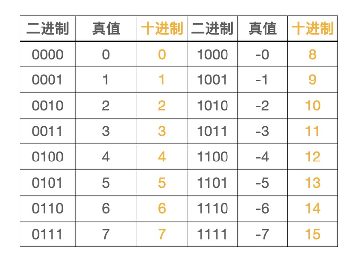
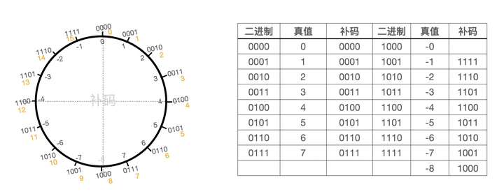
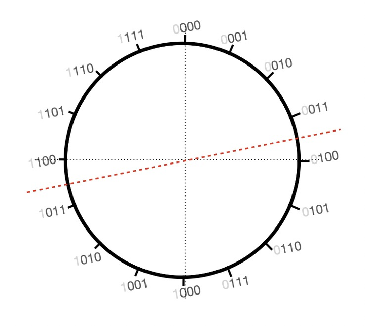

# 原码、反码、补码的探索

在计算机原理中我们了解到：计算机中的数据采用二进制的方式存储的

接下来讨论的都是以整数为例

举个例子：8位机，最高位为符号位(0正1负)，其余7位代表有效位，表示的范围：-128～127  
例如：25 = 00011001，-25 = 10011001

ALU(算术逻辑单元)是计算机中用于对数据运算的部件，分为算术运算(加/减/乘/除)和逻辑运算(与/或/非/位移)，为了设计的简单，所以统一采用加法进行运算，接下来就来探索一下ALU的加减法

为了简单起见，统一采用4位存储（真值：计算机中实际代表的值）

减去一个数相当于加上这个数的负数，如：3 - 1 = 3 + (-1)

先来看一下加法：3 + 1 = 0101 + 0001 = 0110 = 4  可以看出两个正数相加正确

再来看一下减法：3 - 1 = 3 + (-1) = 0101 + 1001 => 1110 = -4 结果并不是想要的

我们知道一个数加上它的相反数结果为0，即 1 + (-1) = 0 => 0001 + ？= 0000

在计数制中为了简化计算，采用的是**计满归零**的方法。我们常见的是指针时钟，例如：现在8点，怎么可以到6点？可以逆时针旋转2格(8 - 2 = 6)，也可以顺时针旋转10格(8 + 10 = 18 即6点)，即满12归零。接下来我们把四位的二进制放到一个圆盘上（0000～1111）

结合二进制对应的真值和十进制，这样就得到下面的圆盘(这里的二进制和真值就是原码)

通过观察上图中右侧的这个圆盘可以发现一个有趣的现象：沿着垂直线分开，左右两边对称的二进制相加结果都为10000，由于只能存4位，高位的进位舍弃，所以就得到了0000即真值0，这也就是上面提到的一个数加上它的相反数结果为0，所以沿着这个思路我们可以把这个圆盘的左半边的真值调整一下，让其满足一个数加上它的相反数结果为0这个定理，于是就得到了下面这个圆盘

我们继续探索，用上面的时钟进行推导减法，假设从3 -> 1 可以逆时针移动2格(即 3 - 2 = 1)，或者是顺时针移动14格(即 3 + 14 = 1)，即 3 - 2 = 3 + 14 = 1，即 0011 + 1110 = 10001 高位的进位舍弃  得到 0001 = 1，观察圆盘又可以发现一个有趣的现象：十进制的14对应调整过后圆盘的-2，这是巧合吗？通过计算并不是，而是精心的设计。其实此时圆盘上面的二进制就是对应圆盘内真值的补码，所以此时就有了**补码**

由于有两个0，这样就会存在两个二进制对应一个真值，所以按照补码的顺序将-0改为了-8，于是就得到了下面的圆盘，此时就解决了计算机中的减法问题，可以通过补码进行减法的加运算并且补码可以表示的数比原码要多一个即：-8 ～ 7

通过观察下面的原码和补码可以发现，补码中右半部分的正数不变，左半部分的负数通过水平线反转得到，不过这是通过观察图形化的结果，但是实际上在计算机中需要计算得到

并且需要统一的去处理原码到补码的转换，还不能引入太复杂的逻辑，于是乎继续观察又会发现一个有趣的现象，符号位左右两边都一样先忽略，并做一条红虚线，沿着下图中的红虚线对称观察可以发现除了符号位剩余3位的值刚好相反，此时又引入了一个新的概念：反码。刚好红虚线距离水平线半格，于是补码就可以通过反码计算得到：补码 = 反码 + 1

总结：**补码是为了解决计算机中减法问题，反码是为了将原码转换成补码而定义的一个中间态，没有实际意义**

参考：
* 《计算机原理》
* [狂风吹我心：二进制的原码、反码、补码](https://zhuanlan.zhihu.com/p/99082236)
* [彻底了解原码反码和补码_哔哩哔哩_bilibili](https://www.bilibili.com/video/BV1Yk4y1r7D4/?spm_id_from=333.788.recommend_more_video.-1)

以上都是个人观点，如有错误感谢指导