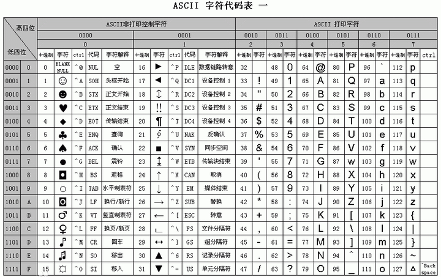
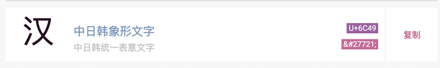
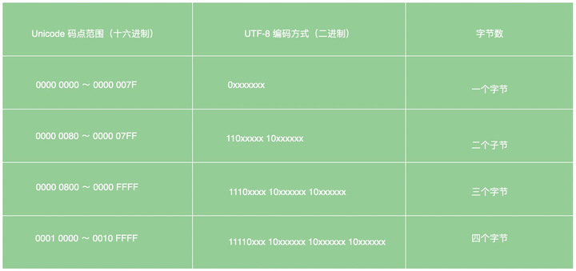
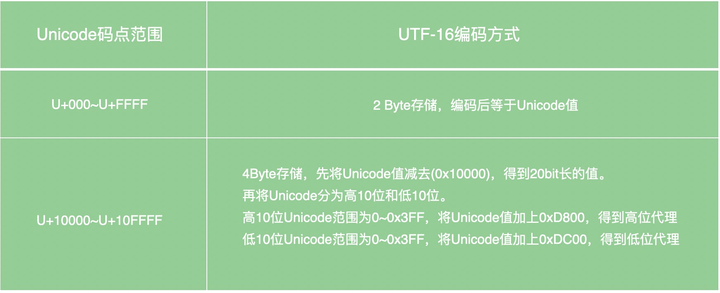
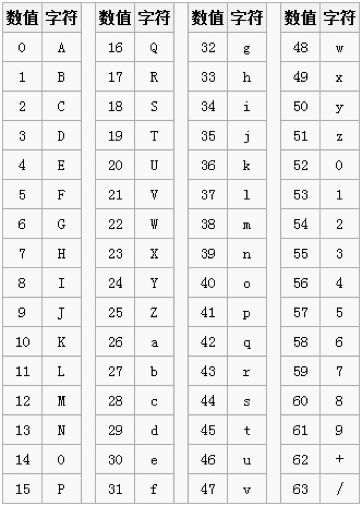
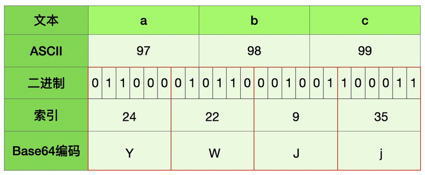
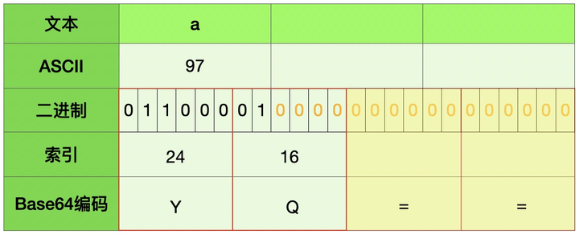
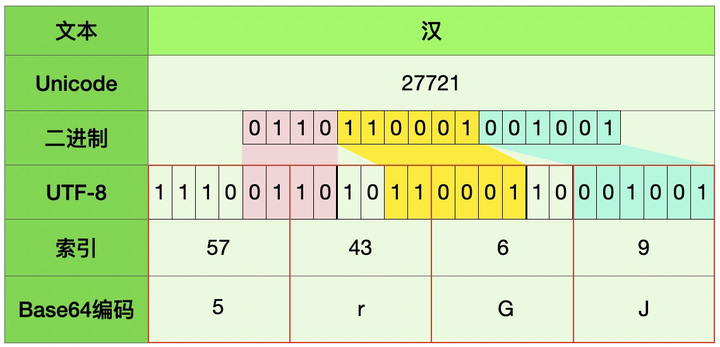
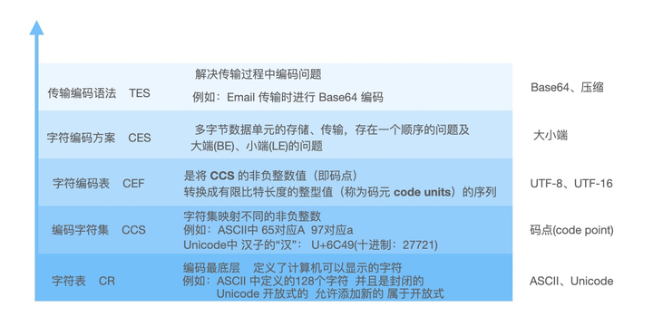

# 编码的前世今生

这段时间突然对计算机的底层原理很感兴趣，从精度丢失问题([JS 中为什么 0.1 + 0.2 != 0.3 ?](../JS中为什么0.1+0.2!=0.3/))到计算机是如何计算的([原码、反码、补码的探索](../原码、反码、补码的探索/))，刚好同事又在周会上分享了《计算机字符编码的介绍》又引起了我的兴趣，于是乎开始扒一扒编码的前世今生

带上几个问题：
* 为什么计算机存储时有的字符占 1 byte、有的占 2 byte、有的占3byte、有的占4 byte？
* 为什么中文占 2 byte？
* base64编码为什么经常后面会有等号(=)？

前置知识：计算机是基于二进制进行存储和计算的(这里有讲解为啥是二进制)

刚开始的时候计算机就是为了运算，随着技术的发展，于是更多的信息出现在了计算机中，这样就需要解决一个信息的存储和展示的问题，因为计算机一开始从美国兴起，所以开始就需要解决英文的显示问题，怎样用二进制表示英文？

其实一开始的设计只针对于26个英语字母，于是只需要5位就可以表示 2^5 = 32

## ASCII
只有26个英文字母不能满足信息的展示，还有大小写、标点符号等信息，于是出现了ASCII(美国信息交换标准编码)，其中前32个+127代表控制字符或通信字符(例如：LF(10) 换行、ACK(6) 确认(通信专用))，其余表示可打印字符

当初的设计从 0～127 一共 128 个字符，对应二进制 0000000 ～ 1111111，即7位就可以表示，后来又扩展了1位用 8 位表示即 1 个字节，**这也就是为什么英文字符占 1 byte 的原因**

随着计算机的普及，ASCII 扩展位已经不能满足各个国家的字符扩展，于是各个国家出现了不同的标准，于是中国出现了国标(GB2312)以及对GB码的扩展GBK，BIG5码是针对繁体汉字的汉字编码等

## Unicode
不同国家都有各自的编码这样在进行信息传输中就出现了另一问题“**乱码**”，为了解决“乱码”问题于是就有了统一的标准Unicode

下面是“汉”字的 Unicode 值

> 事实证明，对可以用ASCII表示的字符使用UNICODE并不高效，因为UNICODE比ASCII占用大一倍的空间，而对ASCII来说高字节的0对他毫无用处。为了解决这个问题，就出现了一些中间格式的字符集，他们被称为通用转换格式，即UTF（Unicode Transformation Format）

## UTF
[字符编码笔记：ASCII，Unicode 和 UTF-8](http://www.ruanyifeng.com/blog/2007/10/ascii_unicode_and_utf-8.html)  
UTF包括UTF-8(1个字节为最小单位)、UTF-16(2个字节为最小单位)、UTF-32(4个字节为最小单位)  

## UTF-8
下表总结了编码规则，字母 `x` 表示可用编码的位

跟据上表，解读 UTF-8 编码非常简单。如果一个字节的第一位是`0`，则这个字节单独就是一个字符；如果第一位是`1`，则连续有多少个`1`，就表示当前字符占用多少个字节，这就是**为什么有的字符占 1 byte、有的占 2 byte、有的占3byte、有的占4 byte**

基础汉字的Unicode编码范围：4E00-9FA5(1001110 00000000-10011111 10100101) 占2byte，也是**在Unicode存储中文时占2byte**

对应到UTF-8编码中则占3byte

以“汉”字为例：U+6C49(Unicode) -> 27721(十进制) -> 01101100 01001001(二进制) -> 1110**0110** 10**110001** 10**001001**(UTF-8二进制) -> E6B189(UTF-8)

## UTF-16
下表总结了编码规则

## UTF-32
UTF-32 都是四个字节存储和Unicode值一样不需要转换

## Base64
为什么会有Base64编码呢？

> 因为有些网络传送渠道并不支持所有的字符，例如传统的邮件只支持可见字符的传送，像ASCII码的控制字符就不能通过邮件传送。像图片或者字符，既然实际传输时它们都是二进制字节流，而且即使Base64编码过的字符串最终也是二进制（通常是UTF-8编码，兼容ASCII编码）在网络上传输的，那么用4/3倍带宽传输数据的Base64究竟有什么意义？  
> 真正的原因是二进制不兼容。某些二进制值，在一些硬件上，比如在不同的路由器，老电脑上，表示的意义不一样，做的处理也不一样。同样，一些老的软件，网络协议也有类似的问题  
> 下面是Base64索引表，用"A-Z、a-z、0-9、+、/” 64个可打印字符来表示所有其它的二进制数据，它的数值表示字符的索引，这个Base64索引表中只有64个字符，也就是用6bit，1个字节内完全可以表示完Base64编码中的字符，同时还多出两位需要补0，同时Base64还有个基本的规定，就是至少用4个字符去表示源字符  

转换大概可以分为下面四步：
1. 第一步，将每三个字节作为一组，一共是24个二进制位。
2. 第二步，将这24个二进制位分为四组，每个组有6个二进制位。
3. 第三步，在每组前面加两个00，扩展成32个二进制位，即四个字节。
4. 第四步，根据上面的表，得到扩展后的每个字节的对应符号，这就是Base64的编码值。

*因为，Base64将三个字节转化成四个字节，因此Base64编码后的文本，会比原文本大出三分之一左右*

例1：`abc -> YWJj`

例2: `a -> YQ==`
当后面不全为“0“的时候转成Base64编码为“=”，**这也就是为什么后面会有等号(=)的原因**

例3: `汉 -> 5rGJ`

## 编码层次
在了解了编码过程中遇到的问题，以及对应的处理方案，所以在编码中可以分为下面5个层次，每个层次都有对应的问题和解决该问题的方案，这也是我们容易混淆的：以为它们都是互斥的，实际是叠加的

以上便是编码的部分发展史，随着计算机的计算能力越来越快，我相信编码也会出现新的问题以及对应的新的解决方案

## 参考
* [编码_百度百科](https://baike.baidu.com/item/%E7%BC%96%E7%A0%81/80092?fr=aladdin)
* [字符编码的奥秘](https://zhuanlan.zhihu.com/p/19857727?from_voters_page=true)
* [了解现代编码模型](https://blog.csdn.net/njsrlb/article/details/120805688)
* [Unicode 字符编码模型_字符编码模式(CEF)](https://www.jianshu.com/p/919a4cf7f809?utm_campaign=maleskine&utm_content=note&utm_medium=seo_notes&utm_source=recommendation)
* [计算机编码起源与发展](https://blog.csdn.net/hgq0916/article/details/81036724)
* [计算机编码的概念（UTF-8，Unicode，utf-16等都是什么）](https://blog.csdn.net/weixin_44239431/article/details/89576098)
* [字符编码笔记：ASCII，Unicode 和 UTF-8](http://www.ruanyifeng.com/blog/2007/10/ascii_unicode_and_utf-8.html)
* [unicode](https://unicode-table.com/cn/)