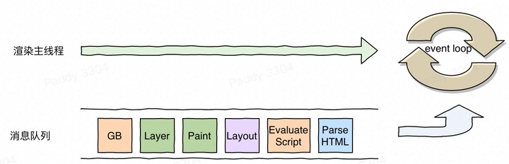
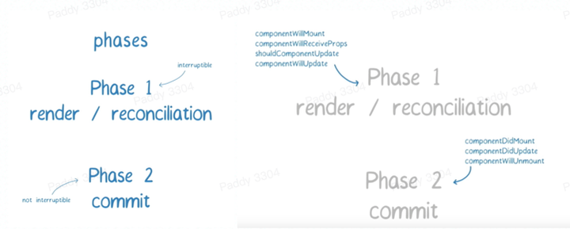
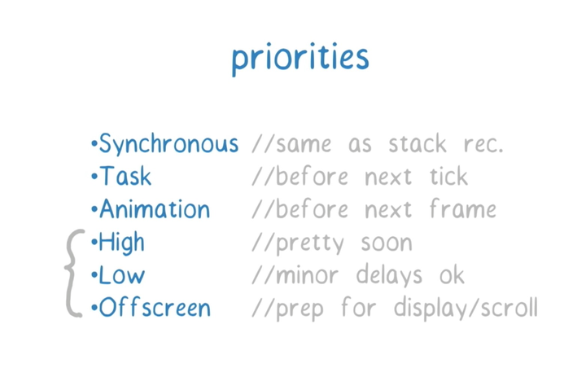
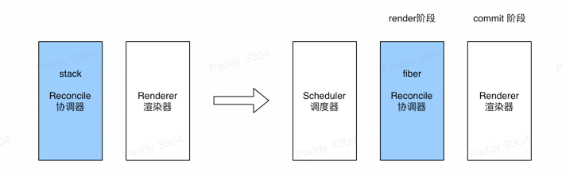
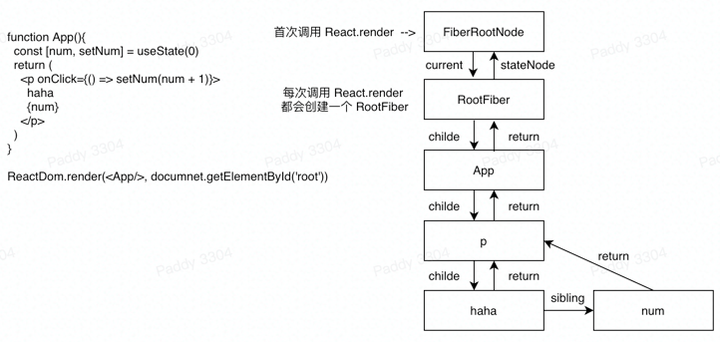
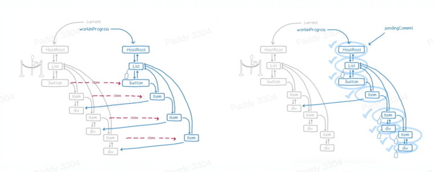
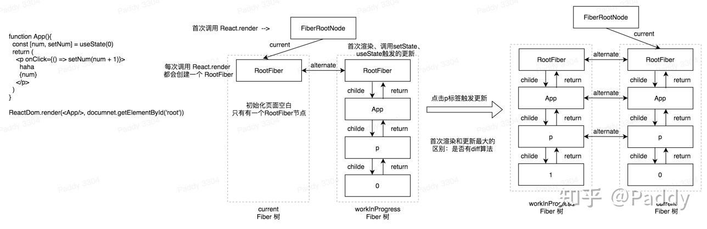

# React新手眼中的Fiber

> 随着进入一个新的工作环境，技术栈也从vue切换到了react，之前没有用过react，也没有系统的学习过，当再次关注react的时候已经和前两年发生了翻天覆地的变化：“什么React Fiber”、“什么React Hooks”等，带着这些心智模型开启了React探索之旅   
> *我的学习过程：先刷官方文档、做demo、然后再刷专题文档和专题视频*  
> 看了2017年 React Conf 大会上 Lin Clark - A Cartoon Intro to Fiber 的分享视频(看了四五遍，都是英语债[狗头])，文章引用的很多图片都来自于该视频截图  
> React Fiber是react团队历时两年的研究成果，是对react核心算法(diff)的重构   
> 这一篇写fiber相关，接下来会写写hooks相关的   

## Fiber(纤程)  
先看一下网上搜到的对纤程的一个解释：纤程(同协程)可以理解为比线程颗粒度更细的并发单元，纤程是用户代码实现的，并不受操作系统内核管理，即无法对纤程实现调度，纤程是根据用户定义的算法来调度的  

## What is “React Fiber”? 
先看一下来自react官方解释：**是一个新的协调引擎，主要用于VDOM的增量渲染**  
> Fiber is the new reconciliation engine in React 16. Its main goal is to enable incremental rendering of the virtual DOM. [Read more](https://github.com/acdlite/react-fiber-architecture)  

## React为什么引入Fiber？ 
浏览器的主线程比较忙，JS解析执行、样式计算、layout、layer。。。   
所以当JS执行时间过长时就会长期占用执行环境，就会造成页面卡顿   

随着用应用复杂度的增加，组件也变得更多、嵌套的也越深了，而之前在状态变更后的diff采用的是递归的方式(stack reconcilation)，如果组件很多嵌套很深，在diff过程中就会消耗很长的执行时间(页面就会卡顿)，而且递归一旦开始则不可停止（如下左图） 

为了给浏览器一个喘息的机会，就需要将一个长任务切分成若干个小任务，每个小任务间隙将执行权交给浏览器（如下右图），就需要小任务可中断，并且下次再次获取到执行权的时候可恢复之前的中断 

为了达到可中断可恢复，需要将任务进行切分，于是将之前的组件树换了一种组织形式：fiber tree(一种单链表结构)，将fiber作为任务的最小单元 

React团队为什么没有选择ES6新增的Generator(协程)，据网上了解：**Generator具有传染性、Generator不可以进行优先级调度** 

## Phases 
当遇到状态更新，分了两个阶段去处理  
阶段1：渲染/协调阶段  
  主要进行fiber树的diff，并生成一颗新的fiber树(workInProgress)，该阶段是可中断可恢复的  
阶段2：提交阶段   
  主要是对变更(副作用)的fiber树进行patch，最终呈现在屏幕上，该阶段不可中断，否则就会出现显示不一致的情况  

## Priorities 
为了让react应用做出及时反馈，就需要给不同的任务分配不同的优先级，同时也需要一个调度器(Scheduler)进行任务的调度  
* **Synchronous**  和之前的同步栈调用一样的执行 
* **Task**  在下一个tick之前执行 
* **Animation**  在下一帧之前执行 
* **High**  立即执行 
* **Low**  可以延迟执行 
* **Offscreen**  显示或者屏幕滚动的时候执行 

## Fiber 的三层含义 
### 从架构层面说 
以前的数据存储在递归的调用栈中  
现在的架构存储在fiber数据结构中  

### 作为静态的数据结构 
每个Fiber节点对应一个React element，保存了该组件的类型（函数组件/类组件/原生组件...）、对应的DOM节点等信息  

### 作为动态的工作单元 
每个Fiber节点保存了本次更新中该组件改变的状态、要执行的工作（需要被删除/被插入页面中/被更新...）  
双缓存：在内存中先构建，构建完之后直接替换  

## 全流程

**参考文档:**  
* [React Fiber Architecture](https://link.zhihu.com/?target=https%3A//github.com/acdlite/react-fiber-architecture)
* [Lin Clark - A Cartoon Intro to Fiber - React Conf 2017](https://link.zhihu.com/?target=https%3A//www.youtube.com/watch%3Fv%3DZCuYPiUIONs)
* [Lin Clark - A Cartoon Intro to Fiber - React Conf 2017(B站)](https://link.zhihu.com/?target=https%3A//www.bilibili.com/video/BV1Gp4y1i7pL%3Ffrom%3Dsearch%26seid%3D12165779767232205918)
* [React 技术揭秘](https://link.zhihu.com/?target=https%3A//react.iamkasong.com/)
* [完全理解React Fiber](https://link.zhihu.com/?target=http%3A//www.ayqy.net/blog/dive-into-react-fiber/)