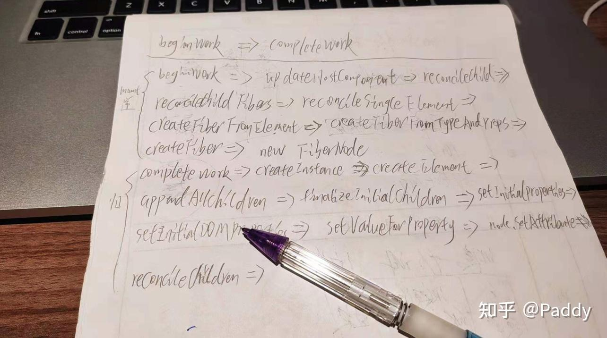

# 践行 Toy React Hooks
> 终于到了用代码说话的时候了  
> 这一篇主要以代码的形式去认知 React Hooks  
> 开启 debug 模式  

## Algebraic Effects(代数效应) 
通过 `try/catch` 语法来认识代数效应，在 `getName` 中抛出一个异常，穿透 `mount`，异常会在最近的 `catch` 块中被处理，这是异常机制的一个重要的特性：中间代码不需要关注异常的处理 

下面注视的为原始代码，注释下面对应的是假设语法 

当遇到 `perform` 之后，进入 `handle` 处理函数，处理完副作用后通过 `resume with` 抛出数据，并返回到 `perform` 继续执行 

这样就把副作用分离出去了(代数效应可以把“做什么”和“怎么做”分离开) 

```js
function getName(user){ 
  let name = user.name; 
  if(name === null){ 
    // throw new Error('no name'); 
    name = perform 'ask_name'; 
  } 
  return name; 
} 
 
const user = { name: null }; 
function mount(){ 
  user.name = getName(user); 
} 
 
try{ 
  mount(); 
} 
catch(error) { // [!code --]
  console.log('handle error:', error); // [!code --]
} // [!code --]
handle(effect) { // [!code ++]
  if(effect === 'ask_name'){ // [!code ++]
    resume with 'Effect'; // [!code ++]
  } // [!code ++]
} // [!code ++]
```

## Toy useState 
接下来一步一步去实现 toy useState 

先来看一下 react useState 的一个简单应用 
```jsx
import React, { useState } from 'react'; 
import ReactDOM from 'react-dom'; 
 
function schedule () { 
  ReactDOM.render( 
    <App />, 
    document.getElementById('root') 
  ) 
} 
 
function App () { 
  const [num, setNum] = useState(0) 
 
  return ( 
    <div> 
      <button onClick={() => setNum(num + 1)}>{num}</button> 
    </div> 
  ) 
} 
 
schedule() 
```

通过对一个 hook 的简单实用可以看出，在函数式组件中可以使用状态管理了 

也没有了生命周期，究竟是什么黑魔法 

接下来一点点的去实现 

先实现一个能跑的简单版 

```js
/* ... */ 
let memoizedState = null 
function useState (initialState) { 
  memoizedState = memoizedState === null ? initialState : memoizedState 
  const dispatch = (newState) => { 
    memoizedState = newState 
    schedule() 
  } 
  return [memoizedState, dispatch] 
} 
/* ... */ 
```

这时候会发现上面对 useState 的实现太单一化，只能满足一个 state 的情况 

接下来基于数组实现一个满足多个 state 的 useState 

```jsx
/* ... */ 
let memoizedState = []  // 使用数组去缓存每个状态 
let index = 0 
function useState (initialState) { 
  const currentIndex = index 
  memoizedState[index] = memoizedState[index] === undefined ? initialState : memoizedState[index] 
  const dispatch = (newState) => { 
    memoizedState[currentIndex] = newState 
    render() 
  } 
  return [memoizedState[index++], dispatch] 
} 
 
function schedule () { 
  index = 0 
  ReactDOM.render( 
    <App />, 
    document.getElementById('root') 
  ) 
} 
/* ... */ 
```

了解到实际 react 是用的单链表实现 hooks 的 

接下来使用单链表进行实现 

```jsx
/* 
  link: { 
    val: 'value1', 
    next: { 
      val: 'value2' 
      next: ... 
    } 
  } 
*/ 
/* ... */ 
let isMount = true 
let workInProgressHook = null 
const fiber = { 
  stateNode: App, 
  memoizedState: null 
} 
function useState (initialState) { 
  let hook 
  if (isMount) { 
    hook = { 
      memoizedState: initialState, 
      next: null 
    } 
    if (fiber.memoizedState) { 
      workInProgressHook.next = hook 
    }else { 
      fiber.memoizedState = hook 
    } 
    workInProgressHook = hook 
  }else { 
    hook = workInProgressHook 
    workInProgressHook = hook.next 
  } 
 
  const dispatch = (newState) => { 
    hook.memoizedState = newState 
    render() 
  } 
  return [hook.memoizedState, dispatch] 
} 
 
function schedule () { 
 workInProgressHook = fiber.memoizedState 
  ReactDOM.render( 
    <App />, 
    document.getElementById('root') 
  ) 
 isMount = false 
} 
/* ... */ 
```

接下将更新函数抽离，并新增加更新链表 

```js
/* ... */ 
function useState (initialState) { 
  let hook 
  if (isMount) { 
    hook = { 
      memoizedState: initialState, 
      next: null, 
 queue: { 
        pending: null 
      } 
    } 
    if (fiber.memoizedState) { 
      workInProgressHook.next = hook 
    } else { 
      fiber.memoizedState = hook 
    } 
    workInProgressHook = hook 
  } else { 
    hook = workInProgressHook 
    workInProgressHook = hook.next 
  } 
 
 let baseState = hook.memoizedState 
  if (hook.queue.pending) { 
    let firstUpdate = hook.queue.pending.next 
    do { 
      const action = firstUpdate.action 
      baseState = typeof action === 'function' ? action(baseState) : action 
      firstUpdate = firstUpdate.next 
    } while (firstUpdate !== hook.queue.pending.next) 
    hook.queue.pending = null 
    hook.memoizedState = baseState 
  } 
  return [baseState, dispatchAction.bind(null, hook.queue)] 
} 
 
function dispatchAction (queue, action) { 
  const update = { 
    action, 
    next: null 
  } 
  if (queue.pending === null) { 
    update.next = update 
  } else { 
    update.next = queue.pending.next 
    queue.pending.next = update 
  } 
  queue.pending = update 
 
  schedule() 
} 
/* ... */ 
```

ok了，一个简化版的 useState 就实现了 

```jsx
import React from 'react'; 
import ReactDOM from 'react-dom'; 
 
let isMount = true  // 手动处理 mount 生命周期 
let workInProgressHook = null  // 当前工作的 hook 
const fiber = {  // 一个 fiber 节点 
  stateNode: App, 
  memoizedState: null 
} 
function useState (initialState) { 
  let hook 
  if (isMount) { 
    // mount 阶段 
    hook = mountWorkInProgressHook(initialState) 
  } else { 
    // 更新阶段 
    hook = updateWorkInProgressHook() 
  } 
 
  let baseState = hook.memoizedState 
  // 如果有更新链表则进入循环链表 执行更新函数 
  if (hook.queue.pending) { 
    let firstUpdate = hook.queue.pending.next 
    do { 
      const action = firstUpdate.action 
      baseState = typeof action === 'function' ? action(baseState) : action 
      firstUpdate = firstUpdate.next 
    } while (firstUpdate !== hook.queue.pending.next) 
    // 本次更新完成 
    hook.queue.pending = null 
    hook.memoizedState = baseState 
  } 
  return [baseState, dispatchAction.bind(null, hook.queue)] 
} 
// mount 阶段 生成 hook 
function mountWorkInProgressHook (initialState) { 
  const hook = { 
    memoizedState: initialState, 
    next: null, 
    queue: {  // 用于存储更新链表 
      pending: null 
    } 
  } 
  if (fiber.memoizedState) { 
    workInProgressHook.next = hook 
  } else { 
    fiber.memoizedState = hook 
  } 
  workInProgressHook = hook 
  return hook 
} 
// 更新阶段返回 hook 
function updateWorkInProgressHook () { 
  const hook = workInProgressHook 
  workInProgressHook = hook.next 
  return hook 
} 
// 将更新函数添加到更新链表中  环链表 
function dispatchAction (queue, action) { 
  // 更新数据 
  const update = { 
    action, 
    next: null 
  } 
  // 环形链表  当前没有时自己指向自己 
  if (queue.pending === null) { 
    update.next = update 
  } else { 
    // 存在时 插入到当前指针的下一个 
    update.next = queue.pending.next 
    queue.pending.next = update 
  } 
  queue.pending = update 
 
  schedule() 
} 
// 模拟调度器 
function schedule () { 
  workInProgressHook = fiber.memoizedState 
  ReactDOM.render( 
    <App />, 
    document.getElementById('root') 
  ) 
  isMount = false 
} 
 
function App () { 
  const [num, setNum] = useState(0) 
  const [num2, setNum2] = useState(2) 
 
  return ( 
    <div> 
      <button onClick={() => setNum(num + 1)}>{num}</button> 
      <button onClick={() => setNum2(num2 + 2)}>{num2}</button>
    </div> 
  ) 
} 
 
schedule() 
```

精力有限目前只研究到了 useState，剩下的还在继续探索



<div class="img-alt">debug手稿</div>